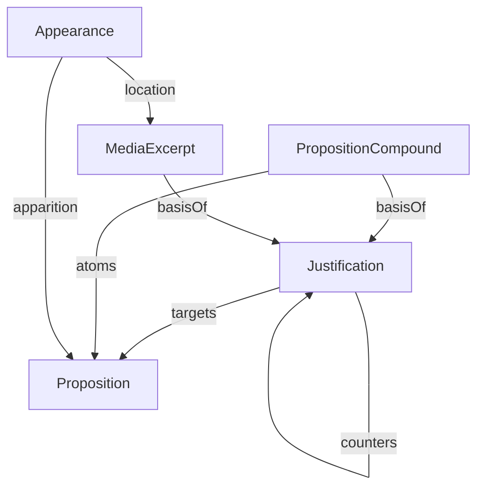

# Concepts

Howdju contains a few primitive concepts that it composes.

This diagram shows Howdju's major entities and their basic relations:

- [Propositions](/concepts/propositions) are the things that may or may not be true.
- [Justifications](/concepts/justifications) provide evidence for a proposition being true or false.
- Justification have [Bases](/concepts/justifications#components) that provide their support.
- The two types of bases are PropositionCompounds and MediaExcerpts.
- [PropositionCompounds](/concepts/justifications#propositioncompound-based-justifications) are an
  ordered list of Propositions and are similar to arguments from propositional logic.
- [MediaExcerpts](/concepts/media-excerpts) are references to a part of an external source.

Howdju also supports critique:

- [Appearances](/concepts/appearances) indicate that a Proposition appears in a Source.
- An Appearance appears at a MediaExcerpt and the thing that appears is a Proposition.

This structure allows a two-step critique of a source:

1. Determine what the speaker is saying (the Proposition appearing in the source)
2. Determine whether the Proposition is true or false.

This analysis determines the truthfulness of the speaker's statement and can be used to judge their credibility.
